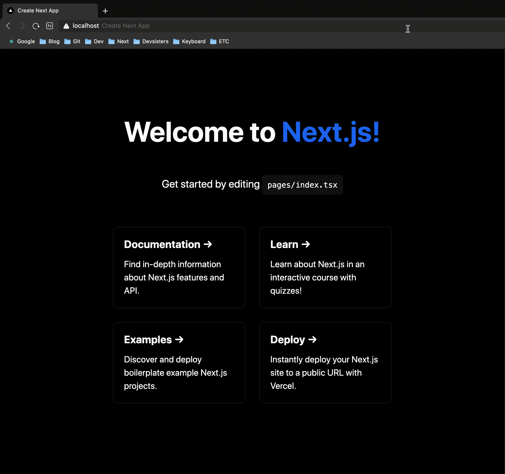
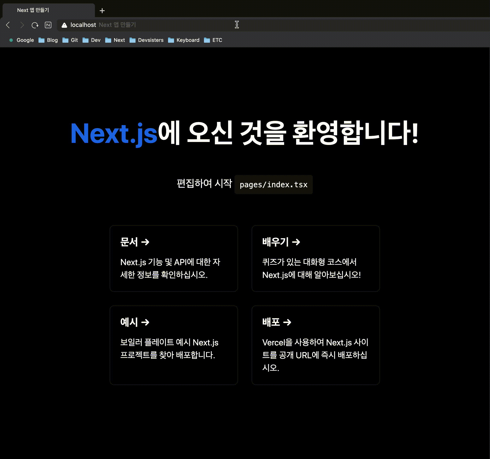
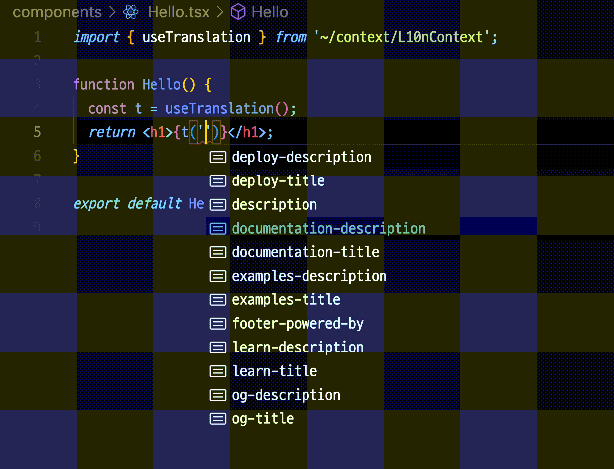

# Next.js Localization Template

> 🌐 Next.js localization template without i18next (Support translation key typegen)

## Demo

When access root(`/`) route, navigate to the page according to each browser settings language.

|                       English                       |                       Korean                       |
| :-------------------------------------------------: | :------------------------------------------------: |
|  |  |

## Support for auto complete of translation keys

Running `yarn dev` will generate `__generated__/translation.d.ts` file.

### Usage `useTranslation` Hook

You can use the translation function by calling the `useTranslation` hook to get a function.

```typescript
function Hello() {
  const t = useTranslation();
  return <h1>{t('hello')}</h1>;
}
```

### Auto complete Demo

A type is created by combining the translation key values ​​for each language in the translation file.



## Supported File Extension

> Details of the code can be found [here](https://github.com/alstn2468/nextjs-localization-template/blob/main/scripts/files.ts).

This template supports `json`, `yaml`, `yml` as a translation file extension.

## Why not use i18next

> _I will probably use [next-i18next](https://github.com/i18next/next-i18next) in production._

- Trying to learn Next.js
- Because it's fun
- For automatic completion of the translation key

<div align="center">

<sub><sup>Written by <a href="https://github.com/alstn2468">@Minsu Kim</a></sup></sub><small>✌</small>

</div>
